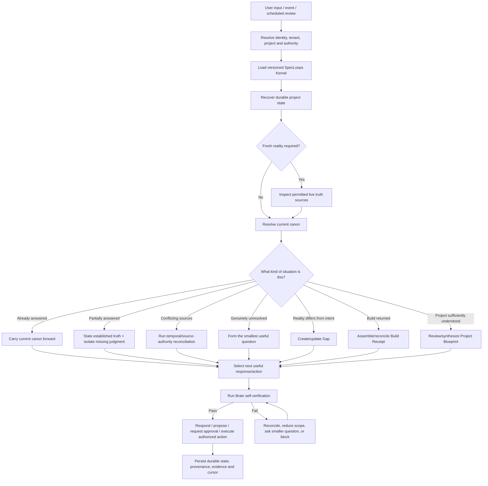
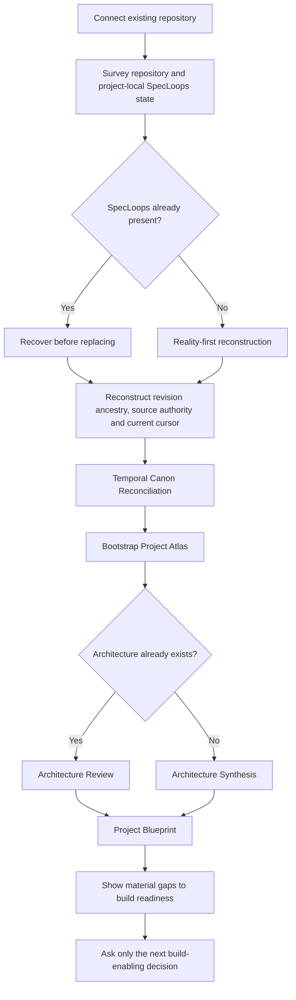
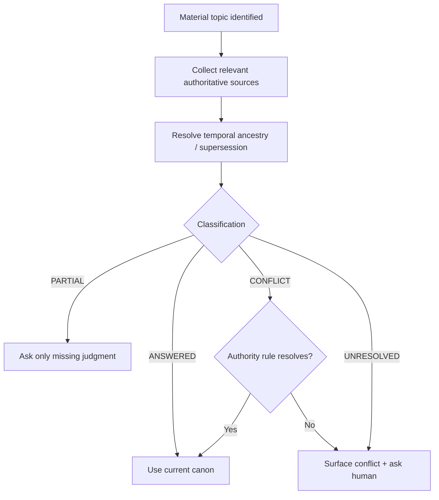
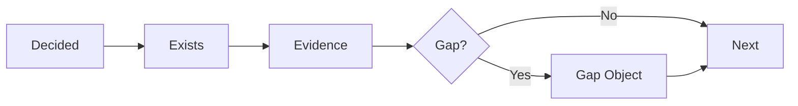
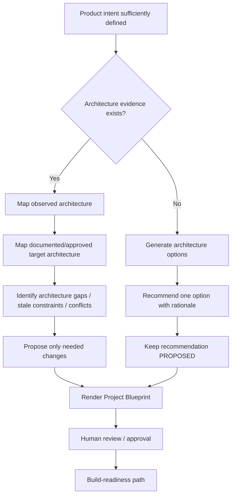
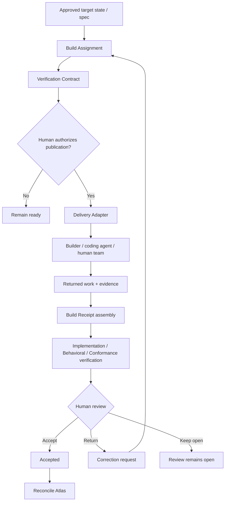
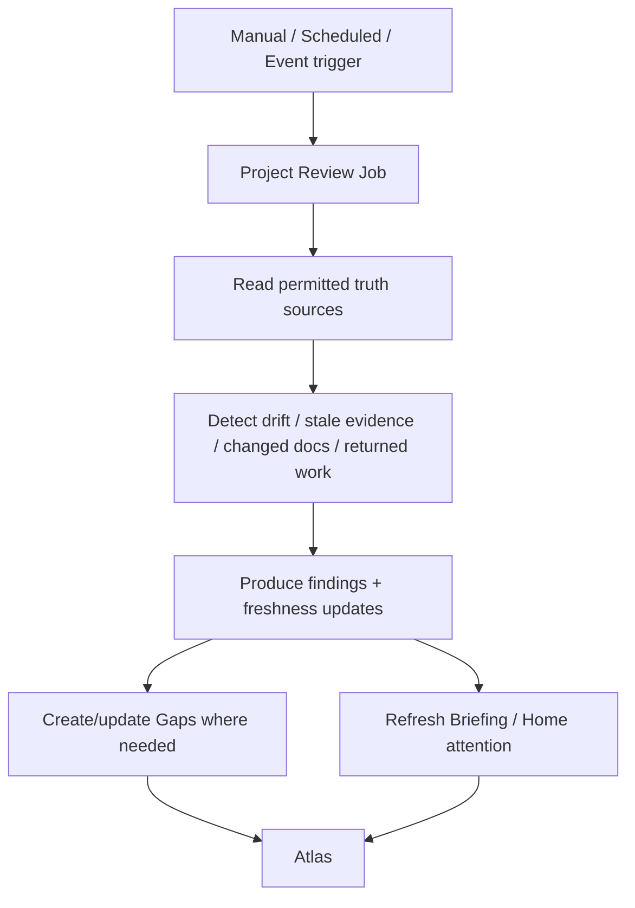
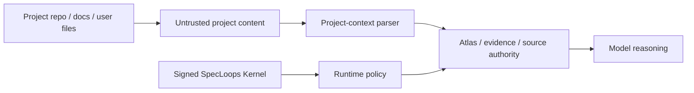
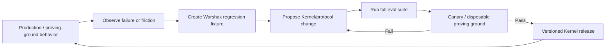

# SpecLoops Brain — Logic Map

**Status:** Canonical platform-direction companion to `SPECLOOPS_BRAIN_KERNEL_EVALS_AND_GUARDRAILS.md`  
**Recorded:** September 16, 2026  
**Purpose:** Make the current SpecLoops reasoning architecture inspectable as a logic tree rather than as a collection of prose rules.  
**Implementation authority:** Documentation only.

## 1. Brain equation

The current product model can be summarized as:

```text
SpecLoops Brain
=
Versioned Kernel
+ Project World / Atlas
+ Active Campaign / Quest
+ Live Reality
+ Transient Conversation
+ Self-Verification
```

The output is not simply an answer. The output is the **next useful governed decision or action**.

```text
KERNEL + PROJECT + REALITY + CURRENT INTENT + AUTHORITY
                           ↓
                 NEXT USEFUL DECISION
```

The Kernel supplies interpretation rules. The project supplies durable truth. Live systems supply current evidence. Conversation supplies temporary working context. Self-verification checks that the result still conforms to SpecLoops.

---

# 2. Top-level logic tree



The important property is that **question generation happens late**. SpecLoops first attempts recovery, retrieval, reconciliation, and classification.

---

# 3. Existing-project first encounter

A mature existing-project path should be:



Durable principles:

> **Recognition before installation. Recovery before replacement.**

> **Canon Before Inquiry.**

> **Recency is evidence, not authority.**

---

# 4. Canon-resolution logic

SpecLoops should resolve current canon before asking a material question.



A material statement can pass through these temporal states:

```text
PRESERVED
REFINED
SUPERSEDED
REJECTED
CONFLICT
STALE
UNKNOWN
```

A newer document is not automatically stronger. A newer **governed human decision** may be.

---

# 5. Question-generation logic

A question is justified only when SpecLoops cannot responsibly recover the answer.

```text
Before asking:

1. Did project canon already answer this?
2. Did a later governed decision supersede the older answer?
3. Is there a conflict rather than a missing answer?
4. Is the missing item actually material to the active campaign?
5. Is the question necessary for the next useful transition?
6. Can the question be narrowed to one decision?
```

If any prior step can resolve the issue, do not ask the broader question.

> **Ask until buildable, not exhaustive.**

> **SpecLoops should ask only for information it cannot responsibly recover from the project itself.**

---

# 6. Project Atlas logic

Atlas is the shared living model, not a duplicate document store.



Every material Atlas object should be able to answer:

- What is this?
- Is it intended, observed, proposed, approved, historical, stale, or unknown?
- Where did it come from?
- What version of the project does it describe?
- What superseded it, if anything?
- What evidence supports it?
- What depends on it?
- What should happen next?

Atlas is the main defense against long-term context loss because it compresses the project into structured current truth plus provenance rather than replaying all historical chat.

---

# 7. Architecture and Blueprint logic



Architecture states must remain separate:

```text
OBSERVED architecture
PROPOSED architecture
APPROVED TARGET architecture
```

The Blueprint is a rendered view of governed Atlas state. It is not a new independent source of truth.

---

# 8. Build transition logic



Durable rules:

> **The builder does the work. SpecLoops defines the contract and checks the receipt.**

> **Coding completion is not human acceptance.**

> **The transport changes. The execution contract does not.**

---

# 9. Resume logic

A resume cursor is a hint, not unquestionable reality.

```text
Saved cursor
    ↓
Reality Before Resume
    ↓
Check repository / returned work / current revisions / external evidence
    ↓
Cursor still valid?
  ↙                 ↘
Yes                  No
↓                    ↓
Resume         Reconcile current world
                     ↓
                New next action
```

This prevents stale state from causing duplicate builds, replayed questions, or incorrect next steps.

---

# 10. Continuous Grounding logic



Default authority:

```text
READ_ONLY
PROPOSE_FINDINGS
NO_CANONICAL_EDITS
```

Continuous Grounding may notice changes. It does not get to silently redefine product intent.

---

# 11. Self-verification logic

Before a consequential answer/action, SpecLoops should run a small invariant checklist.

```text
CANON
- Did I consult relevant current canon?
- Am I replaying an answered question?
- Did I resolve supersession correctly?

REALITY
- Is my evidence fresh enough?
- Does live reality disagree with intent?
- Did I incorrectly infer implementation from docs?

AUTHORITY
- Is this action actually authorized?
- Did I collapse product approval into build/merge/deploy authority?

STATE
- Did I confuse DRAFT, APPROVED, IMPLEMENTED and VERIFIED?
- Did I confuse PROPOSED architecture with approved target architecture?

EVIDENCE
- Can material claims be traced?
- Did I treat unsupported claims as verified?

UX
- Am I exposing machinery before meaning?
- Is this the next useful decision, or merely the next available question?
```

Failure should cause reconciliation, narrowing, or an explicit block—not confident continuation.

---

# 12. Context assembly logic

Long-lived SpecLoops should not build prompts by concatenating the whole project.

Preferred assembly order:

```text
1. Kernel invariants
2. Identity / tenant / authority
3. Current project canon + authority map
4. Active campaign and exact resume state
5. Relevant Atlas objects / gaps
6. Relevant live evidence
7. Relevant source excerpts
8. Historical material only for provenance/conflict
9. Current conversation working context
```

The context compiler should optimize for **minimum sufficient governed context**, not maximum token volume.

This should eventually become a deterministic runtime service rather than a best-effort prompt-writing habit.

---

# 13. Kernel versus project data trust boundary



Project content may contain requirements, decisions, evidence, and even text that looks like instructions. It must never automatically become Kernel policy.

> **Project content may change the project. It may not rewrite SpecLoops.**

---

# 14. Brain health loop



This is how SpecLoops gets smarter without allowing production behavior to mutate itself unpredictably.

---

# 15. Design objective

The mature SpecLoops Brain should make this possible:

> **A fresh Agent with no chat memory can enter a year-old project, reconstruct current canon, explain how it evolved, recover the exact current state, inspect fresh reality, preserve authority, and continue with the correct next useful decision.**

If that is true, SpecLoops is durable.

If continuity still depends on one long conversation, SpecLoops is not yet a product-level operating system.