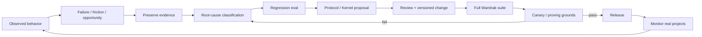

# SpecLoops Self-Learning and Release Loop

**Status:** Canonical platform-direction document  
**Recorded:** September 16, 2026  
**Applies to:** Product learning, proving grounds, Kernel changes, evals, releases, model upgrades  
**Implementation authority:** Documentation only

## Purpose

SpecLoops should learn from real project behavior without allowing the production Brain to mutate itself unpredictably.

The learning target is not:

> “The live Agent rewrites its own rules after every conversation.”

The target is:

> **Reality produces evidence. Evidence produces evals. Evals produce governed Kernel improvements.**

This makes SpecLoops adaptive without making it unstable.

## 1. The learning loop



## 2. Evidence sources

Learning evidence may come from:

- tester feedback;
- user confusion/friction;
- repeated-question incidents;
- authority violations;
- missed conflicts;
- stale resume behavior;
- incorrect build-readiness claims;
- Build Receipt failures;
- project reconstruction failures;
- support cases;
- telemetry;
- eval regressions;
- model/provider changes;
- red-team/security tests;
- Product Room discoveries;
- specialist findings.

Do not treat every anecdote as a Kernel defect. Classify first.

## 3. Failure taxonomy

### Protocol failure

The rules themselves are incomplete or wrong.

Example:

SpecLoops had no rule requiring original repo requirements to be checked before new questions.

Response:

- add/clarify protocol;
- add eval;
- update Kernel.

### Runtime enforcement failure

The correct rule exists but the hosted Agent fails to enforce it.

Response:

- fix runtime implementation;
- keep protocol stable if appropriate;
- add deterministic regression test.

### Retrieval failure

The Agent cannot find relevant project evidence or authority.

Response:

- improve indexing/retrieval/context assembly;
- do not compensate by weakening canon rules.

### Model reasoning failure

The same correct context produces materially wrong interpretation under one model/version.

Response:

- add eval fixture;
- adjust model routing/prompting if safe;
- block or rollback model upgrade if protocol conformance drops.

### UX failure

The underlying state is correct but the user cannot understand it.

Response:

- improve presentation/progressive disclosure;
- do not change state semantics merely to make the UI easier.

### Project-specific ambiguity

The project genuinely lacks enough information.

Response:

- ask the smallest useful human question;
- do not invent a global protocol rule for one project's ambiguity.

## 4. Promotion stages

Every meaningful Brain change should move through explicit stages.

```text
OBSERVED
→ REPRODUCED
→ EVAL_CREATED
→ CHANGE_PROPOSED
→ REVIEWED
→ CANARY
→ RELEASED
→ MONITORED
```

A severe security/authority fix may accelerate the path but should still create a regression eval afterward.

## 5. Proving grounds as learning laboratories

Proving grounds are not just demos.

They are product instrumentation.

Examples:

### SAGE

Tests:

- temporal canon;
- source authority;
- existing SpecLoops recovery;
- Project Blueprint;
- architecture review;
- long decision history.

### Unwritten

Tests:

- Build Result Reconciliation;
- evidence review;
- UX constraints;
- handoff/return behavior.

### Arcanum

Tests:

- safe upgrades;
- question correction;
- draft persistence;
- governance across surfaces.

Each real failure discovered in these environments should become permanent institutional memory through evals and documentation.

## 6. Kernel learning record

A meaningful Brain change should carry:

- issue/failure ID;
- observed project/context;
- evidence;
- severity;
- root cause;
- protocol change;
- Kernel/runtime change;
- new/changed eval IDs;
- canary results;
- release version;
- rollback note if needed.

This creates a history of *why the Brain changed*.

## 7. No live self-rewriting Kernel

Do not allow runtime project interactions to directly rewrite protected Kernel rules.

Disallowed pattern:

```text
User says rule X is annoying
→ production Kernel edits itself
→ all customers behave differently
```

Preferred pattern:

```text
User feedback
→ project-level preference if safe and scoped
OR
→ product evidence / proposed Kernel change
→ eval + review + release
```

Project-level customization may influence allowed behavior within the Kernel's policy envelope. It must not mutate the global enforcement system.

## 8. Project learning versus product learning

Keep these separate.

### Project learning

Updates the customer Project World:

- new requirements;
- decisions;
- supersessions;
- architecture;
- evidence;
- preferences;
- Blueprint;
- Campaign state.

### Product learning

Updates SpecLoops itself:

- Kernel rules;
- retrieval behavior;
- evals;
- UX conventions;
- schemas;
- adapters;
- safety policy;
- model routing.

> **The project evolves continuously. The product evolves through governed releases.**

## 9. Model-upgrade loop

A new model should not be promoted simply because it is newer or scores better on general benchmarks.

Required sequence:

1. run Warshak suite on current production model;
2. run same suite on candidate model;
3. compare per-family regressions/improvements;
4. inspect critical canon/authority failures;
5. run proving-ground canaries;
6. promote only if product-level conformance is acceptable;
7. retain rollback path.

General intelligence is not a substitute for protocol fidelity.

## 10. Customer-year durability review

For projects active for long periods, periodically test cold reconstruction from durable state.

Possible schedule:

- after major Kernel upgrade;
- after major project phase;
- quarterly/biannually for long-running projects;
- before moving into high-risk build/deploy phases.

Test:

> Can a fresh Agent recover the correct project world, current canon, cursor, authority, gaps, and next useful decision without the historical conversation?

If not, durability is failing.

## 11. Product learning scorecard

Track learning-loop health separately from Agent quality.

Examples:

- time from observed critical failure to regression eval;
- percentage of material bugs with permanent eval coverage;
- regression recurrence rate;
- canary escape rate;
- rollback frequency;
- model-upgrade conformance deltas;
- number of protocol changes justified by real proving-ground evidence;
- number of undocumented behavior changes.

Goal:

> **Every real failure should make the system harder to fail the same way again.**

## 12. Release principle

SpecLoops should not become smarter by accumulating hidden ad hoc exceptions.

It should become smarter by improving:

- the Kernel;
- the project state model;
- retrieval;
- eval coverage;
- evidence;
- explainability;
- product UX.

And every improvement should remain inspectable, testable, reversible, and attributable.
