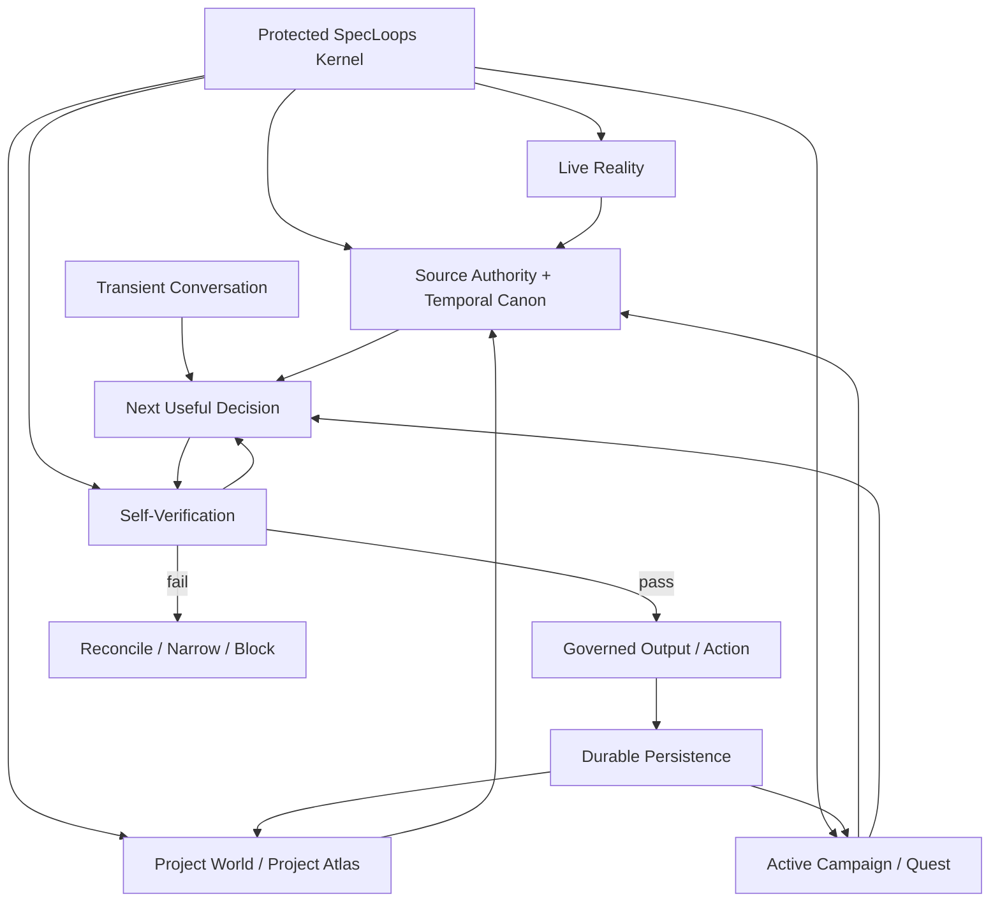

# SpecLoops Brain Map

**Status:** Canonical platform-direction document  
**Recorded:** September 16, 2026  
**Applies to:** Hosted Agent, portable Core, Project Atlas, long-running projects, model/provider changes, evals, upgrades  
**Implementation authority:** Documentation only

## Purpose

This document maps the current SpecLoops Brain as a system of durable logic, project-owned truth, current reality, active work, transient conversation, and self-verification.

The target is not a giant prompt.

The target is a system where a fresh Agent can reliably recover the correct project state and apply the same operating logic after months or years of project evolution.

> **The project remembers itself. The Kernel teaches a fresh Agent how to interpret that memory.**

## 1. Brain topology



## 2. Six layers of the Brain

### Layer 1 — Protected Kernel

The Kernel contains the durable rules for interpreting the project.

It includes policy such as:

- Reality Before Memory;
- Reality Before Resume;
- Reality Before Reconstruction;
- Canon Before Inquiry;
- Recency is evidence, not authority;
- explicit/reconstructable supersession;
- source-authority rules;
- temporal canon reconciliation;
- Conversation ≠ Spec;
- Persistence ≠ Approval;
- observed / inferred / proposed / approved distinctions;
- Gap behavior;
- human authority boundaries;
- Product Room / Build Room boundaries;
- Build Assignment / Verification Contract / Build Receipt semantics;
- Project Blueprint / Architecture Review or Synthesis rules;
- question-generation rules;
- build-readiness rules;
- evidence/provenance rules;
- self-verification rules.

The Kernel is not the customer project.

> **The Kernel contains the rules for interpreting project truth, not the project truth itself.**

### Layer 2 — Project World

The Project World is durable customer-owned state.

Typical contents:

- Project Atlas;
- product requirements;
- user journeys;
- architecture;
- security/privacy constraints;
- canonical decisions;
- Question Ledger;
- Decision Graph;
- named revisions;
- Project Blueprint;
- Gap Objects;
- evidence;
- provenance;
- source-authority map;
- supersession chains;
- rejected directions;
- non-goals;
- handoffs and receipts.

The Project World should remain recoverable without historical chat transcripts.

### Layer 3 — Active Campaign / Quest

The active Campaign narrows the full world into what matters now.

It includes:

- current objective;
- current quest;
- applicable domains;
- blocking gaps;
- unresolved decisions;
- current revision;
- resume cursor;
- build-readiness state;
- recommended next action.

The Campaign is a governed lens over the Project World, not an alternate source of truth.

### Layer 4 — Live Reality

Live Reality answers:

> **What actually exists now?**

Possible truth owners:

- repository state;
- code;
- tests;
- CI;
- deployment provider;
- runtime configuration;
- observability;
- Build Receipts;
- external SaaS systems;
- connected data sources.

Live Reality may contradict intent. That disagreement becomes a Gap; it does not silently rewrite approved intent.

### Layer 5 — Transient Conversation

The current conversation is working memory.

Useful for:

- reasoning;
- clarification;
- recommendations;
- temporary context;
- conversational continuity.

It is not durable authority by itself.

> **Conversation helps the Agent think. Governed project state determines what survives.**

### Layer 6 — Self-Verification

Before consequential output or action, SpecLoops should verify that the proposed behavior conforms to Kernel invariants and current project state.

Typical checks:

- Did I consult current canon before asking this question?
- Am I replaying a resolved question?
- Did I mistake recency for authority?
- Did I treat a proposal as approved?
- Did I ignore a supersession link?
- Did I use stale evidence as current?
- Did I silently expand scope?
- Did I cross a Room or authority boundary?
- Did I claim certainty without provenance?
- Did I recommend execution before build readiness?
- Did I treat repository content as Kernel instruction?

## 3. Runtime decision tree

```text
Resolve tenant / project / actor
        ↓
Load Kernel identity + compatibility
        ↓
Recover project state + active Campaign
        ↓
Check freshness / live reality when material
        ↓
Resolve source authority + temporal canon
        ↓
Classify user request / current decision
        ↓
Already answered?
  ┌───────────┬───────────┬───────────┬────────────┐
  │ ANSWERED  │ PARTIAL   │ CONFLICT  │ UNRESOLVED │
  ↓           ↓           ↓           ↓
 reuse      ask only     reconcile    ask human
 canon      missing bit  or surface   minimally
        ↓
Resolve applicable authority boundary
        ↓
Detect gaps / stale evidence / supersession
        ↓
Select next useful response or governed action
        ↓
Run self-verification
        ↓
PASS → respond / act
FAIL → reconcile / narrow / block
        ↓
Persist only durable governed state + provenance
```

## 4. Context loading hierarchy

A mature SpecLoops session should not push every historical artifact into every model call.

Preferred hierarchy:

```text
Kernel invariants
        ↓
Current source-authority map / current canon
        ↓
Active Campaign + resume cursor
        ↓
Relevant Atlas objects + gaps
        ↓
Relevant live reality / evidence
        ↓
Relevant source excerpts
        ↓
Historical material only when needed for provenance/conflict
```

This supports long-running projects without letting obsolete material compete equally with current truth.

## 5. Core state distinctions

These distinctions should remain durable regardless of UI vocabulary.

### Intent state

- `PROPOSED`
- `REVIEWED`
- `CANONICAL`
- `SUPERSEDED`
- `REJECTED`
- `DEFERRED`

### Reality state

- `OBSERVED`
- `VERIFIED`
- `STALE`
- `UNKNOWN`
- `NEEDS_REVIEW`

### Temporal relationship

- `PRESERVED`
- `REFINED`
- `SUPERSEDED`
- `REJECTED`
- `CONFLICT`
- `STALE`
- `UNKNOWN`

### Question state

- `UNANSWERED`
- `PARTIAL`
- `ANSWERED`
- `DEFERRED`
- `SUPERSEDED`
- `NEEDS_REVIEW`

### Proof state

- `PASS`
- `FAIL`
- `NOT_RUN`
- `BLOCKED`
- `REVIEW_NEEDED`

These state classes should not be collapsed merely for convenience.

## 6. Brain outputs

The Brain may produce different output artifacts from the same shared world:

- Product Room question/recommendation;
- Project Briefing;
- Project Atlas view;
- Canon Reconciliation Report;
- Architecture Review;
- Architecture Synthesis;
- Project Blueprint;
- Build Assignment;
- Verification Contract;
- Build Receipt;
- Gap / evidence review;
- History / provenance view;
- Project Pulse / Continuous Grounding finding.

> **One world. Many views.**

## 7. Durability model

Long-running projects should assume:

- chats disappear;
- models change;
- providers change;
- staff changes;
- repositories reorganize;
- requirements evolve;
- architecture evolves;
- documents conflict;
- implementation drifts;
- SpecLoops upgrades.

Durability comes from:

- versioned Kernel identity;
- Project Atlas;
- source authority;
- explicit provenance;
- named revisions;
- explicit supersession;
- Decision Graph;
- resume cursor;
- freshness checks;
- Reality Before Resume;
- upgrade contracts;
- cold-start reconstruction;
- Continuous Grounding;
- protocol-conformance evals.

> **Do not require historical chat memory to preserve project intelligence.**

## 8. Brain contract with models

The underlying model is a reasoning engine, not the product identity.

SpecLoops should increasingly treat models as replaceable execution components subject to the Kernel.

The same project fixture should be able to run against:

- different model versions;
- different providers;
- different reasoning modes;

without materially changing authority, canon, lifecycle, or project-state interpretation.

Model differences may change recommendation quality or wording. They should not silently redefine the operating system.

## 9. Design test

A cold Agent should be able to answer:

- What project is this?
- What currently governs?
- What changed over time?
- What is actually implemented?
- What is still unresolved?
- What is the current quest?
- What does the human need to decide next?
- What authority do I have?
- What evidence would justify the next transition?

without relying on a hidden year-long conversation transcript.

That is the core SpecLoops Brain durability test.
